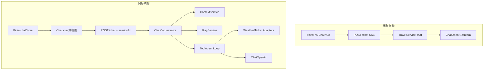
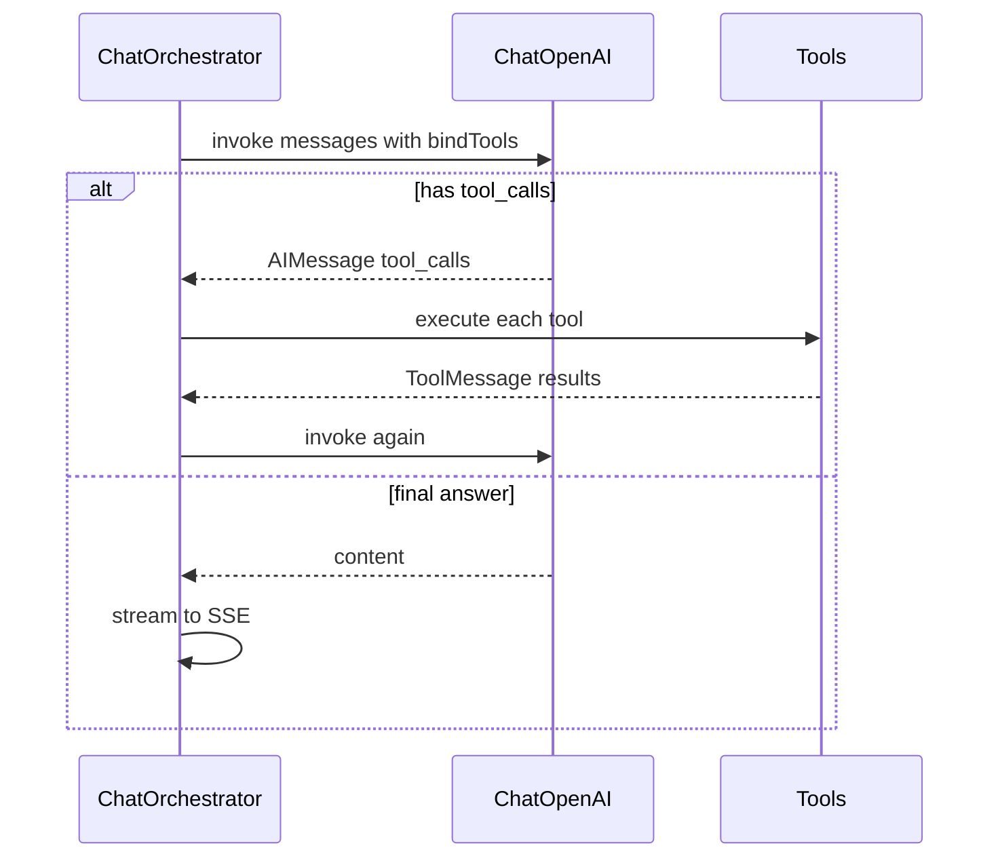

# 旅游 AI 能力升级技术方案

## 现状基线

| 能力       | 现状                                                                                           | 缺口                                          |
| ---------- | ---------------------------------------------------------------------------------------------- | --------------------------------------------- |
| Prompt     | [`travelService.js`](travel-server/src/services/travelService.js) 内联 `HumanMessage` 长字符串 | 无角色/输出分离，无 Schema 约束               |
| 工具调用   | 无                                                                                             | 无天气/票务链路                               |
| 多轮对话   | [`Chat.vue`](travel-h5/src/views/Chat.vue) 本地 `messages`，每次只发 `message`                 | 后端无 session，刷新即丢上下文                |
| Token 优化 | 无                                                                                             | 全量历史会膨胀                                |
| RAG        | 无                                                                                             | 问答仅靠模型参数知识                          |
| 状态管理   | 未安装 Pinia（[`main.js`](travel-h5/src/main.js) 仅 Vue Router）                               | 无跨页上下文（Detail→Chat 仅 query 预填一句） |



---

## 总体原则（对齐项目规范）

- **分层**：Route 只做校验与 SSE；`TravelService` 降为编排入口；LLM/ Prompt / Tool / RAG / Session 各自独立模块（DIP + SRP）。
- **配置外置**：`PROVIDER`、RAG `topK`、裁剪窗口 `MAX_TURNS` 等进 [`travel-server/src/config/`](travel-server/src/config/)，禁止散落魔术数。
- **接口先行**：天气/票务定义 `IWeatherProvider` / `ITicketProvider`，MVP 实现 `Mock*Provider`，真实 API 后续 plug-in。
- **渐进交付**：五阶段可独立上线，每阶段有明确验收点。

---

## 阶段一：结构化 Prompt + 可靠 JSON 输出

### 1.1 目录与职责

```
travel-server/src/
  prompts/
    recommend.system.js    # 角色、约束、禁止项
    recommend.user.js      # 变量模板 city/budget/days
    chat.system.js         # 助手人设 + 工具使用说明（阶段二复用）
  schemas/
    tripPlan.schema.js     # Zod 定义行程 JSON
  llm/
    llmFactory.js          # 从 TravelService 抽出 ChatOpenAI 初始化
  chains/
    recommendChain.js      # 推荐专用链
```

### 1.2 Prompt 设计要点

**System（固定）**

- 角色：专业旅游规划师
- 硬约束：仅输出合法 JSON；字段必须与 Schema 一致；预算/天数不得超出用户输入；禁止 markdown 包裹（或明确「仅 JSON 无废话」）
- 失败策略：若无法满足则输出 `{ "success": false, "error": "..." }`

**User（变量）**

- `city`, `budget`, `days` 及业务规则（与现有校验一致：预算≥100，天数 1–30）

使用 `@langchain/core/prompts` 的 `ChatPromptTemplate.fromMessages([["system", ...], ["human", ...]])`，替代当前 [`getTravelPrompt`](travel-server/src/services/travelService.js) 单条 `HumanMessage`。

### 1.3 结构化输出

- 使用 **Zod Schema**（`tripPlan.schema.js`）描述 `dailyItinerary`、`budgetBreakdown` 等，与前端 [`Detail.vue`](travel-h5/src/views/Detail.vue) 已消费字段对齐。
- 推荐路径：`llm.withStructuredOutput(tripPlanSchema, { method: "json_mode" })` 或 `invoke` + `JsonOutputParser`（按当前 `@langchain/openai` 版本选兼容写法）。
- **删除**手写正则 `jsonMatch` 解析（[`recommend` 第 48–51 行](travel-server/src/services/travelService.js)），统一由 Parser 抛错 → 路由层 502 + 可读 message。

### 1.4 验收

- `/recommend` 返回字段稳定，`success: false` 时前端可展示 `error`。
- 连续 10 次请求 JSON 解析成功率明显提升（可记日志统计）。

---

## 阶段二：LangChain Tool Calling + Mock 服务链路

### 2.1 工具定义

```
travel-server/src/tools/
  weather.tool.js      # structured tool: { city, date? }
  ticket.tool.js       # structured tool: { city, spot, date? }
  index.js             # export tools[]
travel-server/src/adapters/
  mockWeatherProvider.js
  mockTicketProvider.js
  weatherProvider.interface.js   # 文档化契约
  ticketProvider.interface.js
```

使用 `@langchain/core/tools` 的 `tool()`，schema 用 Zod；handler 内调用 `MockWeatherProvider.getForecast(city)` 等，返回 **结构化 JSON 字符串** 供模型二次总结。

### 2.2 Agent 循环（chat 专用）

在 `chains/chatAgent.js` 实现 **手动 Tool Loop**（比引入完整 Agent 框架更可控）：



- `llm.bindTools([weatherTool, ticketTool])`
- 非流式完成 tool 轮次；**最终回复**用 `llm.stream` 输出（或最后一轮若已无 tool_calls 则流式）。
- 工具调用失败：ToolMessage 写入错误摘要，模型向用户解释，不抛 500。

### 2.3 SSE 协议扩展

在 [`streamUtils.js`](travel-server/src/utils/streamUtils.js) / 路由层统一事件类型（前端 [`fetchStream`](travel-h5/src/utils/request.js) 需扩展解析）：

| type         | 含义       | payload                            |
| ------------ | ---------- | ---------------------------------- |
| `chunk`      | 文本增量   | `content`                          |
| `tool_start` | 开始调工具 | `toolName`, `args`                 |
| `tool_end`   | 工具返回   | `toolName`, `summary`              |
| `end`        | 结束       | `sessionId`, `reply`, `toolTrace?` |
| `error`      | 失败       | `message`                          |

### 2.4 Mock 数据约定

- **天气**：返回 `{ city, dates: [{ date, weather, tempHigh, tempLow, tip }] }` 固定模板 + 按 city hash 轻微变化，便于演示「AI 查了天气」。
- **票务**：返回 `{ spot, available, priceRange, bookingUrl }`。
- 环境变量 `TOOLS_MODE=mock`（默认），后续 `real` 切换 Provider 实现。

### 2.5 验收

- 用户问「北京明天天气怎么样」→ 日志可见 tool_call → SSE 有 `tool_start/end` → 回复含天气信息。
- 用户问普通攻略 → 不触发工具或极少误触发（可在 system prompt 中约束触发条件）。

---

## 阶段三：Pinia 状态机 + 会话编排（解决上下文丢失）

### 3.1 后端 Session（权威上下文）

```
travel-server/src/services/
  sessionService.js    # Map<sessionId, SessionState> MVP 内存
```

`SessionState` 字段建议：

- `messages: BaseMessage[]`（LangChain 消息序列）
- `summary: string | null`（阶段四写入）
- `tripContext: { city, budget, days, planId? }`（来自 Detail）
- `toolTrace: []`（最近一次工具调用摘要）
- `updatedAt`

**新 API**

| 方法 | 路径                      | 说明                                                          |
| ---- | ------------------------- | ------------------------------------------------------------- |
| POST | `/api/travel/session`     | 创建 session，可带 `tripContext`                              |
| POST | `/api/travel/chat`        | `{ sessionId, message }`，服务端 append 历史后走 Orchestrator |
| GET  | `/api/travel/session/:id` | 可选：恢复会话（刷新页面）                                    |

`chat` 不再信任客户端上传全量 history（防篡改）；Pinia 仅持 `sessionId` + UI 镜像。

### 3.2 前端 Pinia Store

安装 `pinia`，新增 [`travel-h5/src/stores/chatStore.js`](travel-h5/src/stores/chatStore.js)：

**状态**

- `sessionId`, `messages`（UI 模型：id/role/content/timestamp/meta）
- `tripContext`（从 Detail 写入）
- `status`: `idle | sending | streaming | tool_running | error`
- `activeTool: string | null`

**状态机转移（核心）**

```
idle --sendMessage--> sending --streamStart--> streaming
streaming --tool_start--> tool_running --tool_end--> streaming
streaming --end--> idle
* --error--> error --reset--> idle
```

**Actions（异步编排）**

- `initSession(tripContext?)`：无 sessionId 则 POST `/session`
- `sendMessage(text)`：校验状态 → 乐观插入 user/ai 占位 → `fetchStream` → 按事件更新 messages / status
- `hydrateFromRoute(query)`：Detail 跳转时设置 `tripContext` 并可选首条引导语（替代仅改 `inputMessage`）
- `syncFromServer()`：GET session 恢复（Profile/刷新场景）

[`Chat.vue`](travel-h5/src/views/Chat.vue) 瘦身为：绑定 store 状态、调用 `sendMessage`、展示 `tool_running` UI。

[`Detail.vue`](travel-h5/src/views/Detail.vue) 的 `goToChat`：在跳转前 `chatStore.setTripContext(tripData)` + `initSession`。

### 3.3 验收

- 连续 5 轮对话，模型能引用上一轮内容。
- 从 Detail 带城市进入 Chat，助手知晓当前行程城市/预算（通过 `tripContext` 注入 system）。
- 刷新页面后若实现 GET session，可恢复历史（可选 MVP+1）。

---

## 阶段四：上下文裁剪 + 摘要压缩

### 4.1 ContextService

```
travel-server/src/services/contextService.js
```

**`buildMessages(session, userMessage)` 流程**

1. 注入固定 **System**：chat 人设 + `tripContext` 摘要 + RAG 块（阶段五）。
2. 若有 `session.summary`，作为一条 `SystemMessage`：「此前对话摘要：…」。
3. **保留最近 N 轮**（建议 `MAX_TURNS=6`，可配置）完整 `Human/AI` 对。
4. 追加本轮 `HumanMessage`。
5. **Token 估算**：使用 `@langchain/core` 的 `getNumTokens` 或字符近似；超 `MAX_CONTEXT_TOKENS` 时触发摘要。

**摘要触发**

- 当「被裁掉」的消息累计超过阈值，异步调用 **低成本** `llm.invoke`（`temperature: 0.3`，短 system：「将以下对话压缩为 200 字内要点」）更新 `session.summary`，并从 `messages` 中移除已摘要的旧消息（保留最近 N 轮）。

### 4.2 与 recommend 分离

- `/recommend` 单次调用，不走 session 裁剪。
- `/chat` 每次请求前 `contextService.buildMessages`。

### 4.3 验收

- 模拟 30 轮对话，请求体 token 不线性爆炸（日志记录 message 条数/估算 token）。
- 第 25 轮仍能回答第 1 轮提到的约束（靠 summary 保留）。

---

## 阶段五：内存 RAG（提升问答准确率）

### 5.1 知识库

```
travel-server/data/knowledge/
  cities/*.md          # 城市攻略片段
  faq/*.md             # 常见问题
```

启动时或 CLI `npm run rag:ingest` 加载 → 按段落 chunk（512 字左右，overlap 64）→ 嵌入向量。

### 5.2 RagService（MVP）

```
travel-server/src/services/ragService.js
```

- **Embedding**：与 LLM 同厂商 OpenAI 兼容 `Embeddings`（`llmFactory.createEmbeddings()`），复用 `baseURL` + `apiKey`。
- **存储**：`MemoryVectorStore`（[`@langchain/classic`](https://js.langchain.com) 或 community 包中的 memory 实现），进程内 Map，重启需 re-ingest（可接受 demo）。
- **检索**：`similaritySearch(query, k=4)`，`scoreThreshold` 过滤低相关片段。
- **注入**：在 `contextService.buildMessages` 的 system 中追加：

  ```
  【参考资料】（仅供参考，冲突时以用户问题为准）
  - 片段1
  - 片段2
  ```

### 5.3 与 Tool 协同

- RAG：静态知识（景点介绍、政策、贴士）。
- Tool：动态数据（天气、票务 Mock/未来真实 API）。
- System prompt 明确：**动态事实优先调 Tool，背景知识查 RAG**。

### 5.4 验收

- 知识库中有「丽江高原反应」条目时，问答能引用该内容。
- 无关问题检索分数低时不注入（减少幻觉干扰）。

---

## 依赖变更摘要

**travel-server**（新增）

- `zod`（Schema）
- `@langchain/classic` 或含 `MemoryVectorStore` 的包（按 lock 版本选）
- `uuid`（sessionId）

**travel-h5**

- `pinia`

---

## 关键文件改动映射

| 文件                                                              | 改动                                                 |
| ----------------------------------------------------------------- | ---------------------------------------------------- |
| [`travelService.js`](travel-server/src/services/travelService.js) | 拆分为 orchestrator，委托 recommendChain / chatAgent |
| [`travel.js`](travel-server/src/routes/travel.js)                 | 新增 session 路由；chat 接收 sessionId；SSE 新事件   |
| [`request.js`](travel-h5/src/utils/request.js)                    | 解析 `tool_start/end`；支持 session API              |
| [`Chat.vue`](travel-h5/src/views/Chat.vue)                        | 使用 chatStore；工具状态 UI                          |
| [`Detail.vue`](travel-h5/src/views/Detail.vue)                    | 跳转前写入 tripContext                               |
| [`main.js`](travel-h5/src/main.js)                                | `createPinia()`                                      |

---

## 风险与缓解

| 风险                              | 缓解                                                        |
| --------------------------------- | ----------------------------------------------------------- |
| 结构化输出与 DeepSeek/Qwen 兼容性 | 保留 `json_mode` + Zod 双保险；失败时降级一次 repair prompt |
| Tool 误触发                       | System 中写清触发条件 + 工具 description 精确               |
| 内存 Session/RAG 重启丢失         | 文档说明；后续可换 Redis + Chroma 而不改上层接口            |
| 多轮 token 仍偏高                 | 调低 `MAX_TURNS`、摘要更激进、RAG topK=3                    |
| 前端 SSE 解析碎包                 | 保持按行缓冲 `data:` 解析（现有逻辑），新增 type 分支       |

---

## 建议实施顺序与工期（参考）

1. **阶段一**（1–2 天）：Prompt + Schema + recommend 稳定 — 风险低、收益立竿见影
2. **阶段二**（2–3 天）：Tool + Agent loop + SSE — 核心卖点
3. **阶段三**（2 天）：Session + Pinia — 解决上下文
4. **阶段四**（1–2 天）：裁剪/摘要 — 依赖阶段三
5. **阶段五**（2 天）：知识库 + RAG ingest — 可与阶段四并行部分内容

阶段一～三完成后即可演示完整「规划 → 对话 → 查天气」闭环；阶段四、五为体验与成本优化。
