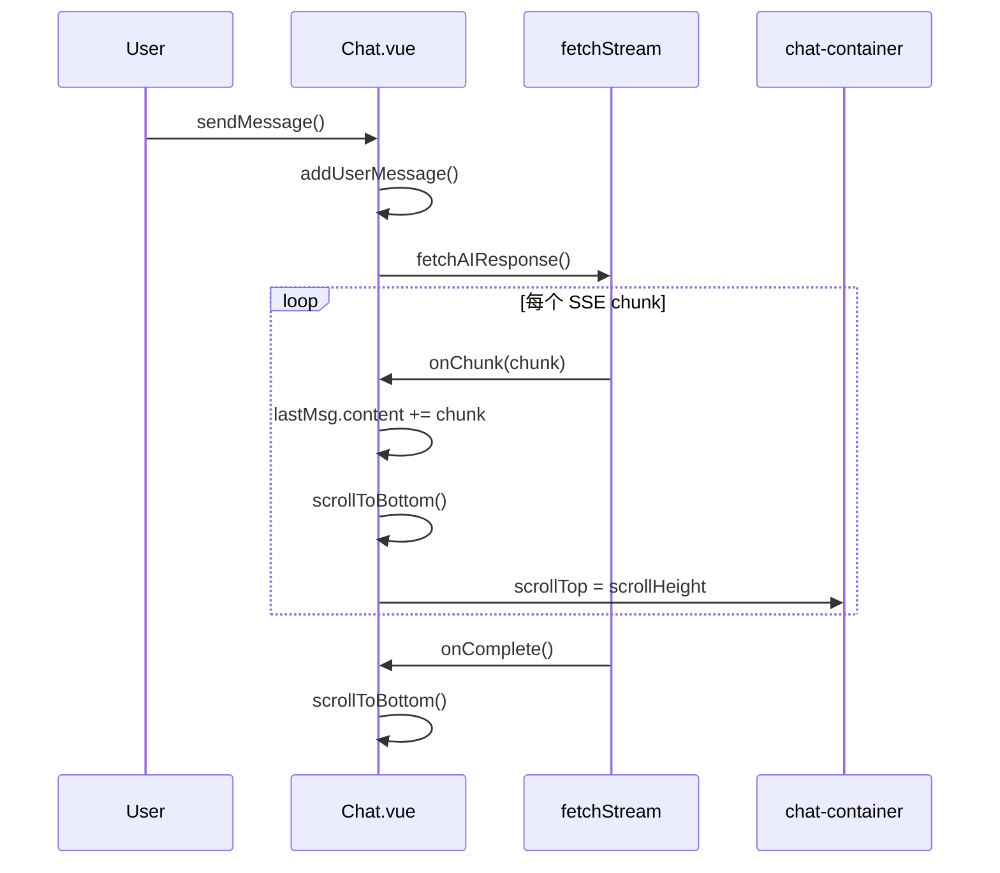
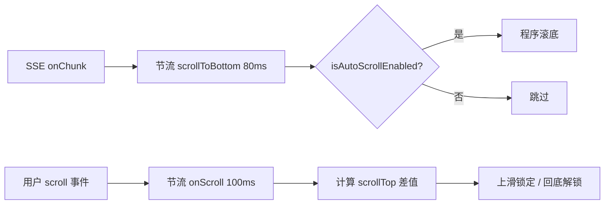

# 流式对话智能滚动抑制 — 技术实现操作文档

## 1. 现状分析

### 1.1 核心文件与数据流



| 文件                                                             | 职责                                         |
| ---------------------------------------------------------------- | -------------------------------------------- |
| [`src/views/Chat.vue`](src/views/Chat.vue)                       | 消息列表、流式回调、滚动控制（当前全部在此） |
| [`src/utils/request.js`](src/utils/request.js)                   | SSE 流解析，逐 chunk 调用 `onChunk`          |
| [`src/components/ChatBubble.vue`](src/components/ChatBubble.vue) | 单条消息渲染，无滚动逻辑                     |

### 1.2 现存问题

**问题 A — 自动滚动未生效（Bug）**

[`Chat.vue`](src/views/Chat.vue) 定义了 `chatContainer = ref(null)` 和 `scrollToBottom`，但模板中 `.chat-container` **未绑定 `ref`**：

```69:74:src/views/Chat.vue
const chatContainer = ref(null);
const scrollToBottom = () => {
  if(chatContainer.value) {
    chatContainer.value.scrollTop = chatContainer.value.scrollHeight
  }
}
```

模板第 12 行为 `<div class="chat-container">`，缺少 `ref="chatContainer"`，导致 `scrollToBottom()` 始终空操作。

**问题 B — 体验冲突**

流式回调中每个 chunk 都无条件调用 `scrollToBottom()`（第 108、111、119 行）。一旦用户上滑阅读历史，会被强制拉回底部。

**问题 C — 性能隐患**

SSE 高频推送时，无节流、无 `nextTick` 等待 DOM 更新，会造成：

- 重复 layout/reflow
- 滚动事件与 programmatic scroll 互相干扰
- 用户意图判定不准确

**问题 D — 发送消息未滚底**

`addUserMessage` 后未调用滚动，用户发送消息后可能看不到自己的消息（修复 ref 后需补充）。

---

## 2. 设计目标

| 场景             | 期望行为                         |
| ---------------- | -------------------------------- |
| 用户处于底部附近 | 流式输出时自动跟随滚底           |
| 用户主动上滑浏览 | 抑制自动滚动，不打断阅读         |
| 用户滚回底部     | 自动恢复跟随                     |
| 用户发送新消息   | 强制滚底并恢复跟随               |
| 流式结束         | 若处于跟随模式，最终校准一次滚底 |

---

## 3. 核心算法：滚动位置差 + 距底阈值 + 节流

### 3.1 状态定义

```js
// 建议提取到 src/constants/chat.js
export const SCROLL_BOTTOM_THRESHOLD = 80; // px，距底小于此值视为「在底部」
export const SCROLL_THROTTLE_MS = 100; // scroll 事件节流间隔
export const AUTO_SCROLL_THROTTLE_MS = 80; // 自动滚底节流间隔
export const SCROLL_UP_DELTA_MIN = 5; // px，向上滚动最小差值，过滤误触
```

```js
// 运行时状态（useSmartScroll 内部）
let lastScrollTop = 0; // 上次 scrollTop，用于计算位置差
let isAutoScrollEnabled = true; // 是否允许自动滚底
let isProgrammaticScroll = false; // 标记程序触发的 scroll，避免误判为用户操作
```

### 3.2 距底距离计算

```js
function getDistanceFromBottom(el) {
  return el.scrollHeight - el.scrollTop - el.clientHeight;
}

function isNearBottom(el) {
  return getDistanceFromBottom(el) <= SCROLL_BOTTOM_THRESHOLD;
}
```

### 3.3 用户意图判定（滚动位置差）

在 **节流后的** `scroll` 监听中：

```js
function onScroll() {
  const el = containerRef.value;
  if (!el || isProgrammaticScroll) return;

  const currentTop = el.scrollTop;
  const delta = currentTop - lastScrollTop; // 正=向下，负=向上
  lastScrollTop = currentTop;

  if (delta < -SCROLL_UP_DELTA_MIN) {
    // 用户明显向上滑 → 锁定自动滚动
    isAutoScrollEnabled = false;
    return;
  }

  if (isNearBottom(el)) {
    // 用户回到底部 → 恢复自动滚动
    isAutoScrollEnabled = true;
  }
}
```

**为何用位置差而非仅距底判断：**

- 仅距底：流式增长时 `scrollHeight` 变大，即使用户未操作，`distanceFromBottom` 也会增大，可能误判为「离开底部」
- 位置差：只有 `scrollTop` 相对减小才视为「用户上滑」，程序设 `scrollTop = scrollHeight` 时 `delta ≥ 0`，不会误锁

### 3.4 程序滚底时的防误判

```js
async function scrollToBottom(force = false) {
  const el = containerRef.value;
  if (!el) return;
  if (!force && !isAutoScrollEnabled) return;

  await nextTick(); // 等 Vue 更新 DOM 后再读 scrollHeight

  isProgrammaticScroll = true;
  el.scrollTop = el.scrollHeight;
  lastScrollTop = el.scrollTop;
  // 下一帧解除标记，避免 scroll 事件误判
  requestAnimationFrame(() => {
    isProgrammaticScroll = false;
  });
}
```

### 3.5 节流策略（双层）



| 层级 | 触发源        | 节流对象              | 目的                          |
| ---- | ------------- | --------------------- | ----------------------------- |
| L1   | 用户 `scroll` | `onScroll` 100ms      | 降低意图判定频率，保证准确性  |
| L2   | SSE `onChunk` | `scrollToBottom` 80ms | 合并高频 DOM 写操作，保障性能 |

节流函数建议新建 [`src/utils/throttle.js`](src/utils/throttle.js)（约 15 行，不引入新依赖）：

```js
export function throttle(fn, delay) {
  let timer = null;
  let lastArgs = null;
  return function (...args) {
    lastArgs = args;
    if (timer) return;
    timer = setTimeout(() => {
      fn.apply(this, lastArgs);
      timer = null;
      lastArgs = null;
    }, delay);
  };
}
```

流式场景使用 **trailing throttle**（间隔内多次 chunk 合并为一次滚底），比 rAF 更适合控制频率上限。

---

## 4. 模块拆分建议

遵循项目现有结构（无 composables 目录），推荐新增两个轻量文件，[`Chat.vue`](src/views/Chat.vue) 只负责编排：

```
src/
├── constants/chat.js          # 滚动相关常量
├── utils/throttle.js          # 通用节流
├── composables/useSmartScroll.js  # 智能滚动 composable
└── views/Chat.vue             # 接入 composable
```

### 4.1 `useSmartScroll.js` 对外 API

```js
export function useSmartScroll(containerRef) {
  const isAutoScrollEnabled = ref(true);

  const scrollToBottom = (force = false) => {
    /* ... */
  };
  const throttledScrollToBottom = throttle(
    () => scrollToBottom(),
    AUTO_SCROLL_THROTTLE_MS,
  );
  const resetAutoScroll = () => {
    isAutoScrollEnabled.value = true;
    scrollToBottom(true);
  };

  onMounted(() => {
    containerRef.value?.addEventListener("scroll", throttledOnScroll, {
      passive: true,
    });
  });
  onUnmounted(() => {
    containerRef.value?.removeEventListener("scroll", throttledOnScroll);
  });

  return {
    isAutoScrollEnabled,
    scrollToBottom,
    throttledScrollToBottom,
    resetAutoScroll,
  };
}
```

### 4.2 [`Chat.vue`](src/views/Chat.vue) 改动要点

**模板：**

```html
<div ref="chatContainer" class="chat-container"></div>
```

**脚本接入：**

```js
import { ref, onMounted, nextTick } from "vue";
import { useSmartScroll } from "../composables/useSmartScroll";

const chatContainer = ref(null);
const { throttledScrollToBottom, resetAutoScroll, scrollToBottom } =
  useSmartScroll(chatContainer);

// addUserMessage 末尾
resetAutoScroll();

// fetchAIResponse onChunk
throttledScrollToBottom();

// onComplete / onError
scrollToBottom(); // 非 force，尊重用户锁定；或 scrollToBottom(false) 仅跟随模式滚底
```

**发送消息 vs 流式 chunk：**

- 用户发消息 → `resetAutoScroll()`（force 滚底 + 解锁）
- 流式 chunk → `throttledScrollToBottom()`（受 `isAutoScrollEnabled` 约束）

---

## 5. 边界场景处理

| 场景                           | 处理方式                                                                                  |
| ------------------------------ | ----------------------------------------------------------------------------------------- |
| 流式输出中内容增高，用户未操作 | `scrollTop` 不变、`delta = 0`，不触发锁定；若 `isAutoScrollEnabled` 为 true，节流滚底跟随 |
| 用户快速 flick 上滑            | 节流后仍能捕获 `delta < -5`，锁定生效                                                     |
| 程序滚底触发 scroll 事件       | `isProgrammaticScroll` 标志跳过判定                                                       |
| 切换会话 / 清空消息            | 调用 `resetAutoScroll()`                                                                  |
| 组件卸载                       | `onUnmounted` 移除 listener，避免泄漏                                                     |
| 空消息列表 → 首条消息          | `onMounted` 或首条 push 后 `nextTick` + `resetAutoScroll`                                 |

---

## 6. 可选增强（非必须）

- **「回到底部」浮钮**：当 `!isAutoScrollEnabled && isStreaming` 时显示，点击 `resetAutoScroll()`。提升可发现性，可按 UI 需求后续加。
- **iOS 弹性滚动**：`-webkit-overflow-scrolling: touch` 已在部分浏览器默认，若出现 overscroll 误判可适当增大 `SCROLL_UP_DELTA_MIN`。

---

## 7. 实施步骤（操作清单）

1. 新建 [`src/constants/chat.js`](src/constants/chat.js)，写入阈值常量
2. 新建 [`src/utils/throttle.js`](src/utils/throttle.js)
3. 新建 [`src/composables/useSmartScroll.js`](src/composables/useSmartScroll.js)，实现完整逻辑
4. 修改 [`src/views/Chat.vue`](src/views/Chat.vue)：
   - 模板绑定 `ref="chatContainer"`
   - 引入 composable，替换裸 `scrollToBottom` 调用
   - `addUserMessage` 后调用 `resetAutoScroll()`
5. 本地验证（见第 8 节）

---

## 8. 验证用例

| #   | 操作                                    | 预期                           |
| --- | --------------------------------------- | ------------------------------ |
| 1   | 发送消息，观察流式输出                  | 列表自动滚底，始终看到最新内容 |
| 2   | 流式输出中上滑 100px+                   | 停止自动滚底，可稳定阅读历史   |
| 3   | 上滑后手动滚回底部                      | 恢复自动滚底                   |
| 4   | 上滑锁定期间流式继续                    | 不再被强制拉回                 |
| 5   | 锁定期间发送新消息                      | 强制滚底并恢复跟随             |
| 6   | DevTools Performance：高频 chunk        | scroll 回调 ≤ 10次/秒，无卡顿  |
| 7   | 从 Detail 页带 query 进入自动填充并发送 | 正常滚底                       |

---

## 9. 改动范围评估

- **新增文件**：3 个（constants、throttle、composable），合计约 80–100 行
- **修改文件**：1 个（Chat.vue，约 20 行变更）
- **不改动**：`request.js`、`ChatBubble.vue`（流式协议与渲染层无需变更）
- **无新依赖**：节流自实现，符合当前 `package.json` 最小依赖原则
